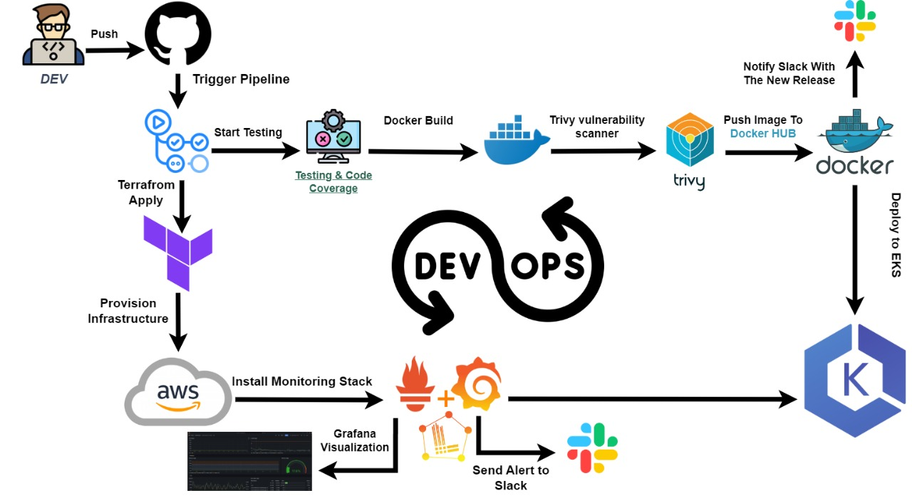
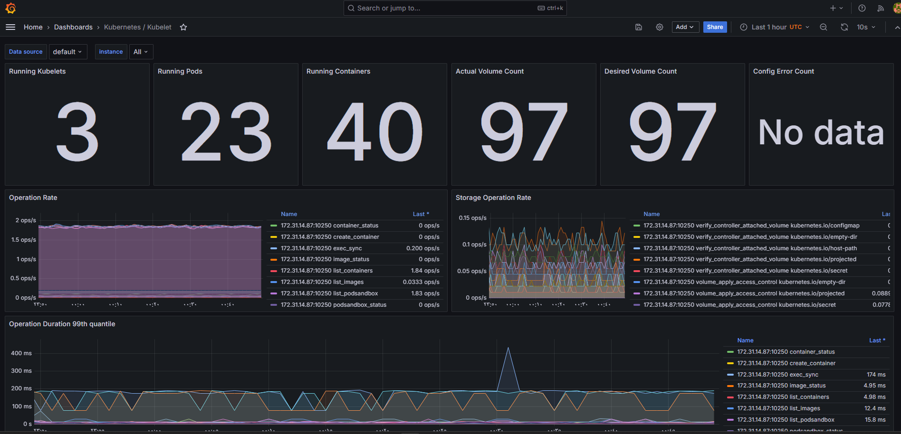
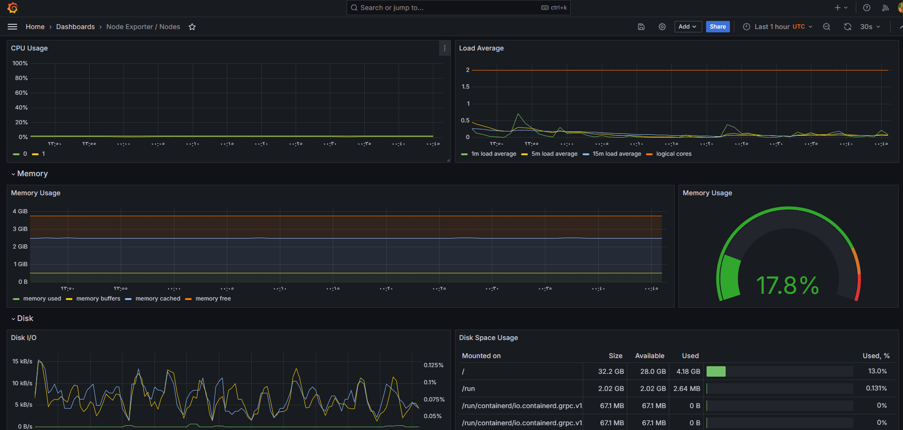

# Simple Go Project

A modern, full-stack application built with Go, featuring a microservices architecture, containerization, and comprehensive monitoring.

## 🚀 Technologies & Tools

### Backend
- Go (Golang)
- PostgreSQL
- Docker
- Kubernetes
- Prometheus & Grafana for monitoring

### Frontend
- React.js
- Nginx
- Docker

### Infrastructure & DevOps
- Terraform for infrastructure as code
- Ansible for configuration management
- GitHub Actions for CI/CD
- Docker Compose for local development
- Kubernetes for container orchestration

## 📋 Project Structure

```
.
├── backend/           # Go backend service
├── frontend/          # React frontend application
├── kubernetes/        # K8s deployment configurations
├── prometheus/        # Monitoring configurations
├── terraform-modules/ # Infrastructure as Code
├── ansible/          # Configuration management
└── docker-compose.yml # Local development setup
```

## 🏗️ Architecture



## 🚀 Getting Started

### Prerequisites
- Docker and Docker Compose
- Go 
- Node.js and npm
- Terraform
- Ansible
- kubectl

### Local Development
1. Clone the repository
```bash
git clone https://github.com/AB-Rhman/simple-go
cd simple-go
```

2. Start the services using Docker Compose
```bash
docker-compose up -d
```

3. Access the applications:
- Frontend: http://localhost:80
- Backend API: http://localhost:8080
- Prometheus: http://localhost:9090
- Grafana: http://localhost:3000

## 🔄 CI/CD Pipeline

Our GitHub Actions workflow automates the following processes:

1. Code Quality Checks
   - Linting
   - Unit Tests
   - Integration Tests

2. Build & Push
   - Build Docker images
   - Push to Docker Hub

3. Deployment
   - Deploy to Kubernetes cluster
   - Run smoke tests
   - Verify deployment health


## 📊 Monitoring

The project includes comprehensive monitoring using Prometheus and Grafana:

- System metrics
- Application metrics
- Custom business metrics
- Alerting rules







## 🔧 Infrastructure

The infrastructure is managed using Terraform and Ansible:

- Kubernetes cluster setup
- Network configuration
- Security groups
- Load balancers
- Database instances
